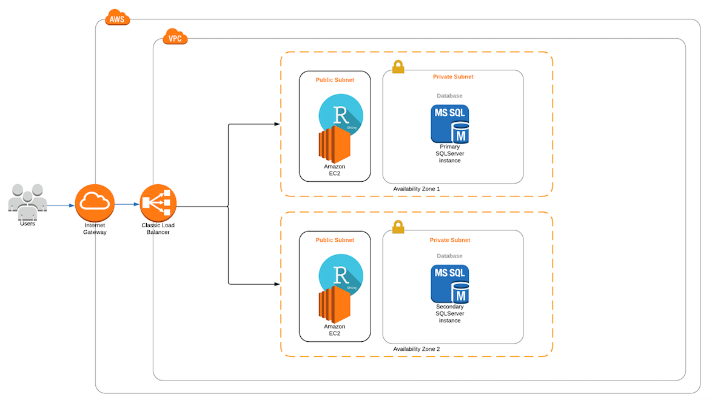

## Introduction

Software as a service (SAAS) is a business model that has become very familiar to most people. Many of the interactions we have with some of the most popular corporations is through a SAAS business model. Whether its for entertainment (Netflix/Hulu/AmazonPrime), socialization (Facebook/Twitter/Snapchat), financial management (Mint/Betterment), more and more firms are looking to deliver their products/services through a SAAS model.

All that being said, what is a SAAS? It's such a buzzword today, but do most regular folks really get what that means? To better understand the nature of this increasingly common arrangement, we seek to implement a small application that leverages some of the key technological components of a SAAS.

## Implementation Plans

### Infrastrucutre

While there are many cloud service providers, Amazon has by far the most services available on their platform. We will take advantage of just a few of those services in this implementation. The application itself will be hosted leveraging the Elastic Compute (EC2) service and the data the application uses to run will be held in a MySQL database on the Relational Database Service (RDS). In order to accomodate a large user load, we will use a load balancer to distribute incoming traffic across multiple instances of the described EC2/RDS infrastructure. Below is a diagram displaying the envisioned configuration.

### Data

The Global Terrorism Database - hereafter referred to as GTD - is an open-source database of domestic, transnational, and international terrorist incidents. This database contains credibly sourced information regarding over 170,000 terrorist incidents from 1970 through 2016. For recent incidents, this data includes 135 quantitative and categorical variables describing all manner of information regarding the incident itself. These points include information regarding the weapons used, number of fatalities, amount of property damage involved, and whether any organization or individual(s) claimed credit for the incident. The majority of these cases are bombings, assassinations, and kidnappings. The GTD is maintained by the University of Maryland's *National Consortium for the Study of Terrorism and Responses to Terrorism (START).* START makes the data available both to government representatives and any interested parties.

We opted to filter the data to only consider those incidents which were both confirmed acts of terrorism and were successfully executed. Furthermore, for data visualization, we excluded those events which did not have latitude and longitude coordinates. This brought the number of incidents examined down from over 170,000 to roughly 113,000. Thus the app detailed below demonstrates visualization methods for displaying confirmed and successful terrorist incidents for which precise geographical information was available.

### Application

**Shiny** is an R package for building interactive web apps from within RStudio. These apps can be embedded in R Markdown documents, hosted as standalone apps on a webpage, or built as dashboards. In addition, they can be extended with JavaScript, CSS themes, and htmlwidgets. Many R packages are developed both for local use and integration with Shiny for interactivity. As the GTD data subset we used contained latitude and longitude coordinates, a mapping package was a logical and appropriate choice. 

We chose **Leaflet**, an R wrapper for the widely-used JavaScript library of the same name. Leaflet allows for highly-customizable map widgets with parameters for the widget itself and the user interface. Some of the many functions of Leaflet include chloropleths, GeoJSON and TopJSON maps, multi-layered maps, projections, and - with the addition of the **leaflet.extras** package - heatmaps. Many of these functions support markers and circle markers as ways to provide both interactivity and a richer source of detailed information to the end user. Additionally, through the use of database connecting R packages, such as DBI, Leaflet can visualize data hosted externally, such as in the present example of an AWS-hosted RDS instance.

For the present project, we opted to include three separate Leaflet visualizations in our Shiny web app. Upon launching the app, the end user is presented with a world map devoid of any markers or data. The *Please select a dataset* dropdown menu presents three choices:

1. *Total Successful Incidents* - a heatmap of all 113,000 successful and confirmed terrorist incidents, grouped by latitude and longitude coordinates.
2. *Total Incidents By Decade* - a heatmap of successful and confirmed terrorist incidents, grouped by both decade and coordinates. 
  + Selecting this dataset shows an otherwise-hidden secondary dropdown menu for decade selection.
  + By default, the heatmap will show incidents form the 1970s.
3. *Incidents With Excessive Property Damage* - a map of successful and confirmed terrorist incidents which resulted in at least $1,000,000 of property damage.
  + These incidents are identified via clustered map markers. Upon mouseover, the geographical bounds of the clustered region is indicated.
  + Clicking on an individual marker displays a popup which provides information regarding the incident, perpetrator, and estimated damage.

These three visualizations demonstrate some of the capabilities offered through Shiny and Leaflet avaiable in a SAAS offering. Locally and remotely-hosted data can be transformed in R and then elegantly displayed to provide interactive and actionable visualization utilizing Shiny and Leaflet.

## Results

### AWS Application Infrastructure

Some screenshots and comments about actually putting everything together. Including some more detailed commentary about the networking and security side of stuff.

### Data & Application

Some screenshots and commentary about the application.

## Further development

Ideas about further development like integrating authentication which would allow you to give different clients access to their own data because you know who is logged in. Some further ideas for app development.

